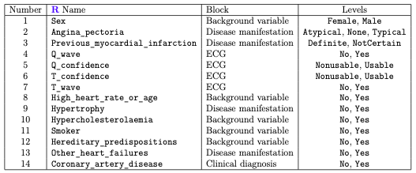
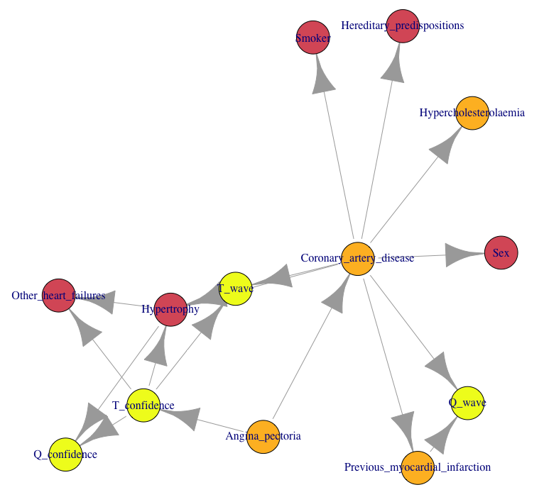
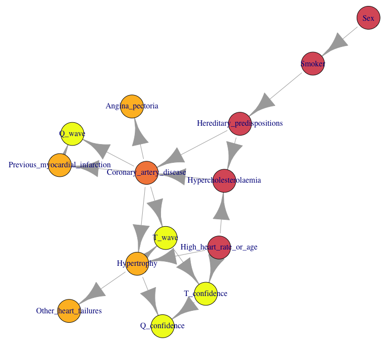
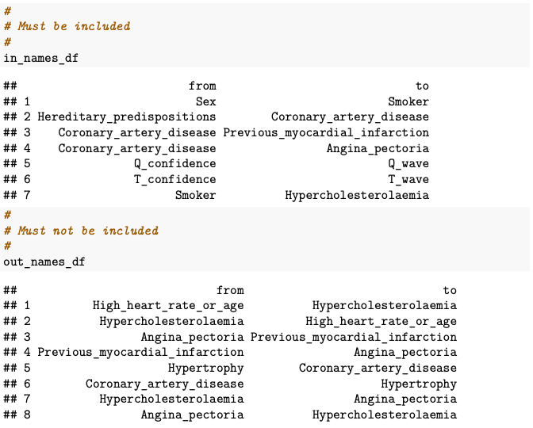
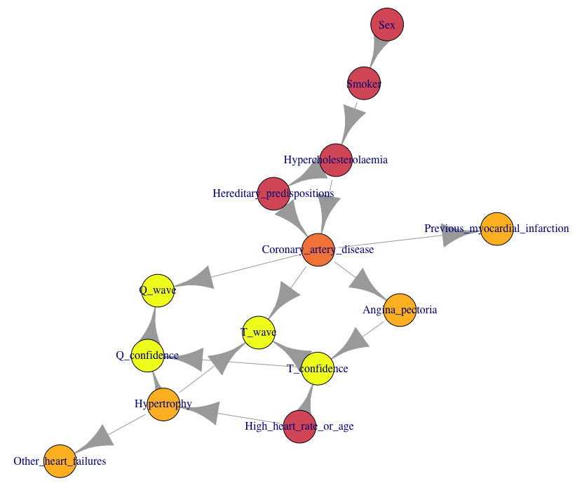
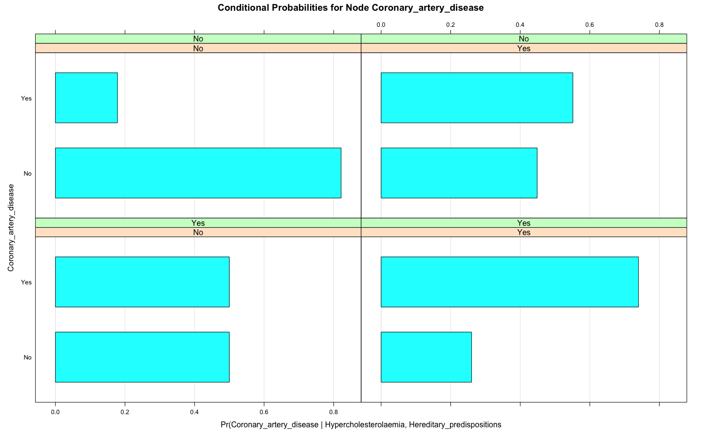
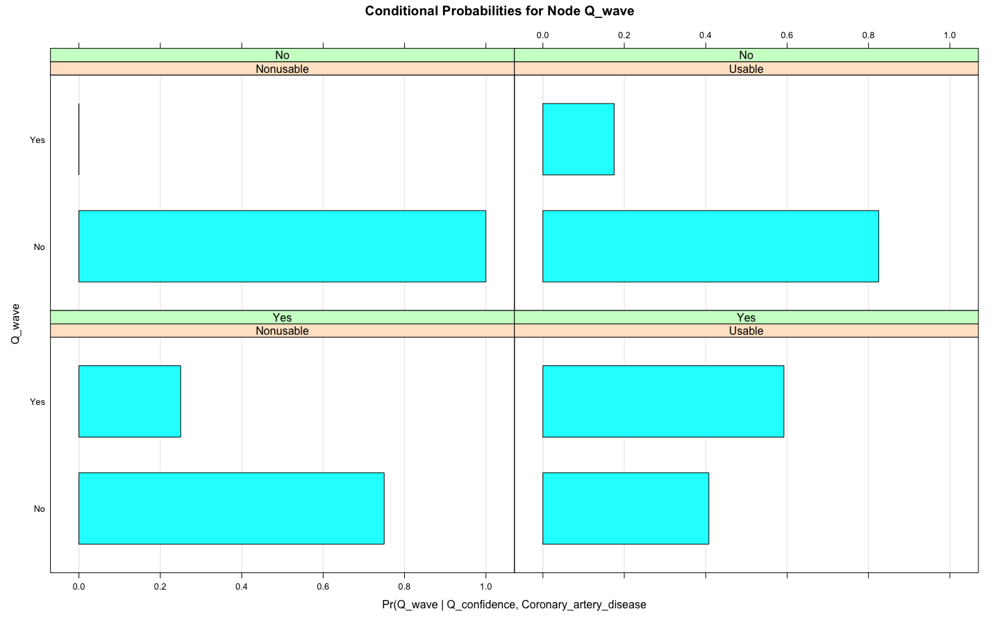
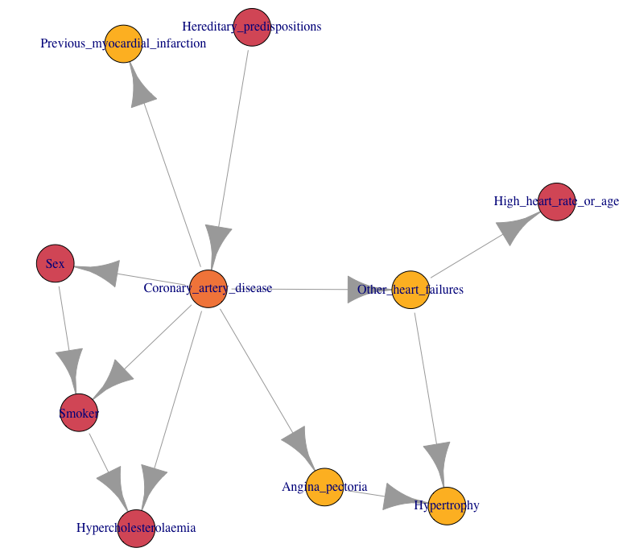

# Modelling Coronary Artery Disease with Bayesian Network

## Introduction

This group academics project was made in the frame of the Graph theory and Optimisation course at Plymouth University (2020). The data used in this coursework are discussed in detail in Højsgaard and Thiesson (1995) and are relevant to coronary artery disease. The following variables are available in the file **Coronary_artery_disease_data_full_names.csv**, with the order being taken from the file. The clinical diagnosis in Coronary_artery_disease on the state of the disease is made on the basis of coronary arteriography. We want to understand the diagnoses in this variable better.

## Variables

Each variable belongs to a ‘block of variables’, as indicated in the table below.



The variable High_heart_rate_or_age is a composite variable and describes whether the heart frequency plus the age of the patient exceed 180; it is better to be No on this variable than Yes. Because High_heart_rate_or_age contains age information, it is taken to be a background variable.
‘Hypertrophy’ is sometimes spelt ‘Hypertrophi’ and is related to increased muscle size.
There are results on the clinical ECG-examinations, that is, information on Q-wave and T -wave presence. In addition, the variables Q_confidence and T_confidence indicate how much confidence to have in the Q-wave and T -wave results. 

## Tasks 

### Use of the function **hc** to learn the structure of a Bayesian Network from the data, by optimising the Bayesian Information Criterion score.



*Fig. 1: Optimised Bayesian network from raw data provided obtainead using the hill-climbing algorithm in R. Blocks for their respective factors are illustrated with the vertex colours. Lighter colours represent higher blocks and darker colours represent lower blocks.*

Bayesian Information Criterion score: -1783.82

The hill climbing optimisation algorithm starts with an arbitrary solution of the task and by making step by step changes, attempts to find a better solution. The algorithm accepts only the changes which improve the score. The process continues until no more changes can be made to improve it, depends on a problem either maximize or minimize. In our case, hill-climbing starts from the empty graph of the CAD_data data frame and follows the graph from vertex to vertex trying to maximise the score by adding, removing, or reversing the arcs between the vertices. So, only the arcs which improve the score the most are accepted. This process forms the optimal Bayesian network.

### The optimized network computed by **hc** function is ‘implausible’.

The optimised network is implausible as some arcs do not represent realistic relationships between the different factors. For example, the development of habitual smoking or the sex of an individual cannot be affected or influenced by coronary artery disease.
Following the medical doctor’s comments, a better graph was produced showing the ordering of the blocks for their respective variables from the given table. We can see clearly that the arcs are in the direction from the vertices with the lower to higher ordering of blocks. Thus, addressing the discrepancies from the previous graph in *Fig. 1* (i.e. sex and smoking influence).

Different colours of the vertices indicate their respective block groups. Colouring was used for visual aid. Darker colours are used to represent blocks with lower ordering while lighter colours represent blocks with higher ordering. This is useful as we can see easily which parameters (vertices) may trigger development of the coronary artery disease and then which types of illnesses are developed in people who already suffer from that disease. It also provides an easy visual check if our network agrees with the imposed blacklist. Lastly, the score for the new network has decreased from -1783.82 to -1797.7, and hence we have a less optimal solution, but better given the additional constraints.


 *Fig. 2: The new optimised Bayesian network with the imposed blacklist based on the factors’ block ordering.*

### Introduction of new lists of edges that should be included and should not be included.

There are now, in addition to the natural ordering constraint just discussed, edges that should be included and edges that shouldn’t be included in the network, as follows:



These new constraints gave us the following network.


*Fig 3. The optimised network with additional blacklist and whitelist entries as specified.* 

The new network score given the block ordering and newly imposed whitelist and blacklist: -1812.521.

The network with the new constraints has one fewer arc compared to the previous two networks (18 arcs against 19) given the additional constraints. Hence, the score decreases from -1797.70 to -1812.521.

### Fitting the optimized network to the data using the maximum likelihood method.

We aimed to check if the value we obtained from the fitted Bayesian network is expected, we calculate the conditional probabilities by hand and conclude that the conditional probabilities calculated by hand agree with the conditional probabilities obtained from the bn.fit() command. The code used in showed below.

```{r}
m <- bn.fit(CAD_3, CAD_data, method = "mle")
m$Coronary_artery_disease

t <- table(CAD_data[, c(14,10,12)])
prop.table(t, c(3,2))
```

### Conditional probabilities for nodes Q_wave and Coronary_artery_disease.


*Fig. 5.1: Conditional probabilities of the effects of hypercholesterolaemia and hereditary predispositions on the risk of developing coronary artery disease. Hereditary predisposition is given in green and hypercholesterolaemia in red.*

Individuals who do not suffer from hypercholesterolaemia and are not exposed to any hereditary predispositions have a relatively low risk (3.14 times lower) of having coronary artery disease compared to those who suffer from hypercholesterolaemia and are exposed to hereditary predispositions, as shown in *Fig. 5.1*. However, in 50% of individuals with hereditary predispositions who do not suffer from hypercholesterolaemia, the disease is prevalent. Conversely, individuals who do not have hereditary predispositions and suffer from hypercholesterolaemia show a 5 percent-point higher risk of coronary artery disease. Besides, individuals who do not suffer from hypercholesterolaemia with hereditary predispositions are 2.80 times as likely to d:evelop the disease than those without any predisposition.

Therefore, we can hypothesis that having hypercholesterolaemia and hereditary predispositions does significantly increase the risk of coronary artery disease, with hypercholesterolaemia taking precedence in importance, while hereditary predisposition may be seen as an intermediary factor.


*Fig. 5.2: Conditional probabilities of the effects of Q-confidence and coronary artery disease on the Q- wave result. Q-confidence is given in red and coronary artery disease in green.*

Given in the first panel of *Fig. 5.2*, no instance of coronary artery disease and non-usable Q-confidence is shown, and there is 100% certainty that there is no Q-wave. Hence, there is a direct effect on Q- wave by the factors Q-confidence and coronary artery disease and this is also shown in the network in *Fig. 3*.
We hypothesise that Q-confidence may be a measure of our certainty of the result of Q-wave given a particular result of having coronary artery disease✓or not. As there is no usable confidence and no coronary artery disease present in the first panel of Fig. 5.2, we can be certain that there is no Q-wave. However, given an instance of coronary artery disease and no usable Q-confidence, there is a probability of having Q-wave, though still in favour of not.
Regarding coronary artery disease, we hypothesise that it is neither affected by Q-confidence nor Q- wave. This is further evidenced by the network in Fig. 3 and the initial block orderings given.

### Statistical tests to check the edges.

We tested if the arcs between vertices Smoker and Hypercholesterolaemia ; Q_confidence and Q_wave ; and Coronary_artery_disease and T_confidence should be included in the network. To do so, we used the command **ci.test()**. The p-values for all three tests are less than 0.05 (supposing we are testing at 95% confidence), suggesting that they all should be included in the graph. 

### Approximate the probability p that a person has coronary artery disease given that the person is female, a non-smoker, has a high heart rate or age, has atypical angina pectoria, has a T-wave, but no Q-wave.


Logic sampling randomly chooses a state for each condition inputted in the function. Every condition (or node in the network) has two states (‘yes’ or ‘no’, for example), which gives us a total of 2*7=14 states. Every state is equally likely to occur. In contrast, the likelihood weighing method uses more information by weighing the states using their prior probabilities. It is hence a more complex algorithm giving less fluctuated results. Thus, the likelihood weighing method is preferred to logic sampling. A million iterations are a good choice when applying this algorithm and gives more accurate results.

### Assuming that no ECG information is available, finding a new optimal Bayesian Network in the absence of the associated variables.

Assuming now that we have no ECG information provided to us in the original data, the actions in Task 1 to Task 3 are executed with the new data. The R code is shown below, and the new optimal Bayesian network is shown in Fig. 8. Constraints such as the block order (represented visually with the vertex colours in Fig. 8); the given whitelist; and the given blacklist excluding any factors from the ECG block; are included in the network.


*Fig. 8: The new optimised Bayesian network with the same constraints from the three first steps, except now without ECG information.*

```{r}
cpquery(bn.fit(CAD_8, CAD8, method = "mle"), 
        (Coronary_artery_disease == "Yes"),
        list(Sex = "Female", Smoker = "No",
             Previous_myocardial_infarction = "Definite",
             Angina_pectoria = "Atypical"), 
        n = 1000000, method = "lw")
```

Simulations using the likelihood weighting method are used to estimate the conditional probability that a female non-smoker with definite myocardial infarction and atypical angina pectoria has coronary artery disease from the latest iteration of the Bayesian network. The result of approximately 0.170 (17%) is found thanks to the code above. *(The remaining of the probabilities calculated using **cpquery()** function are visible in the source code.R.)*

However, when ECG information is included, the probabilities given by cpquery are much higher than without its inclusion. Indeed, the probability increase from approximately 0.248 (24.8%) when both Q-wave and T-wave are negative, up to 0.872 (87.2%) when the results of both Q-wave and T-wave are positive. Therefore, we can hypothesise that these additional factors are crucial in the disease’s determination and should not be discarded from our model.
